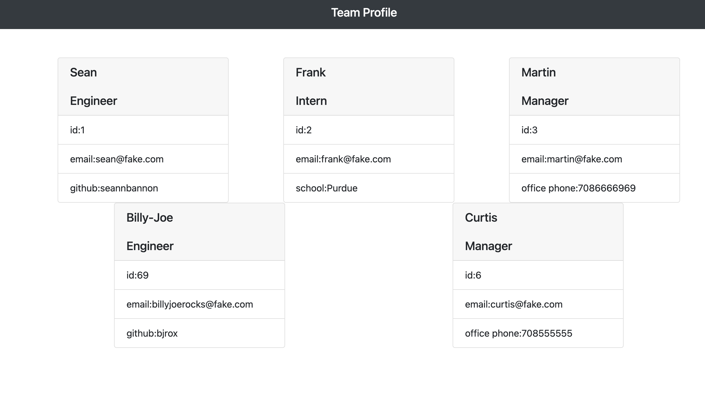

# team-profile-generator

##Introduction
The Team Profile Generator is a command-line-input application run in Node that requests information from the user about members of an engineering team and generates an HTML file displaying that information.

##Installation
Node index.js

##Pictures

##Video Link of Deployment
chrome-extension://mmeijimgabbpbgpdklnllpncmdofkcpn/ng/app/app.html#/files/9e7f778d-2c21-487b-y474-880daa9af4b2

##Contributers
Sean Bannon
